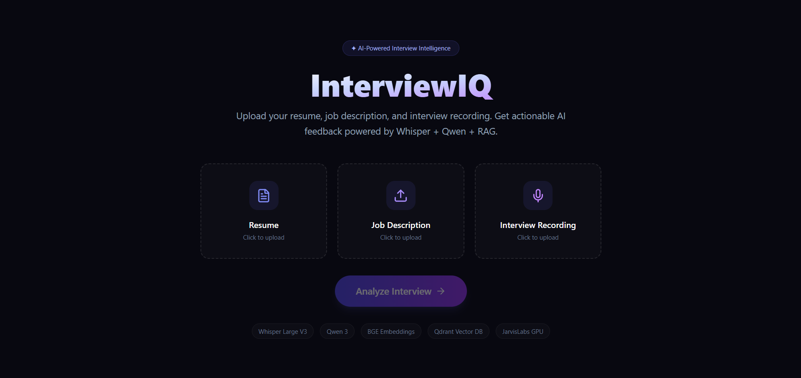
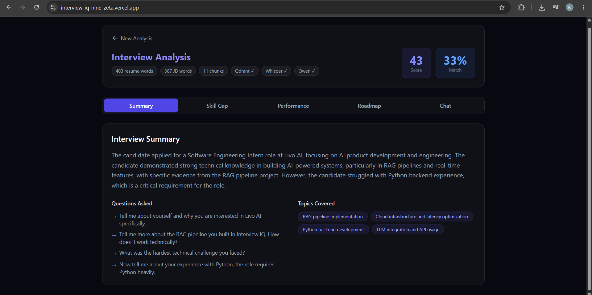
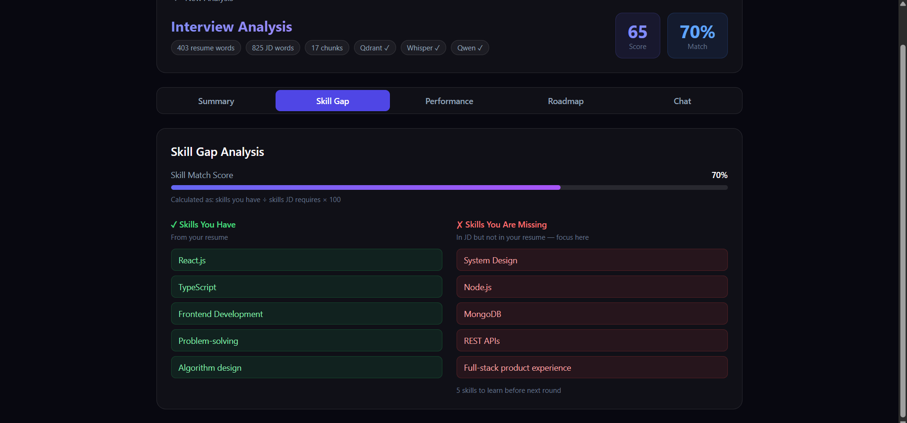
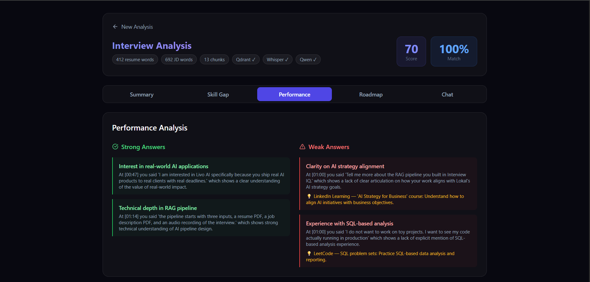
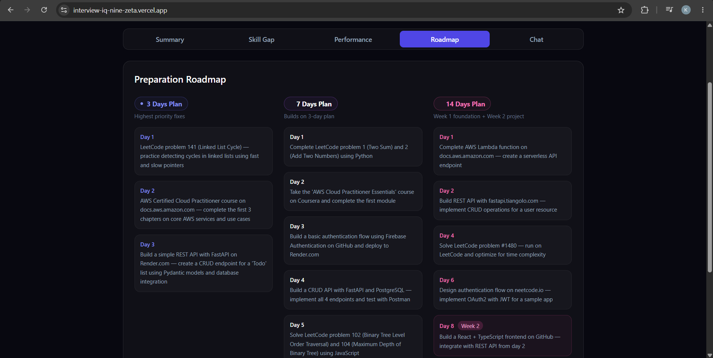
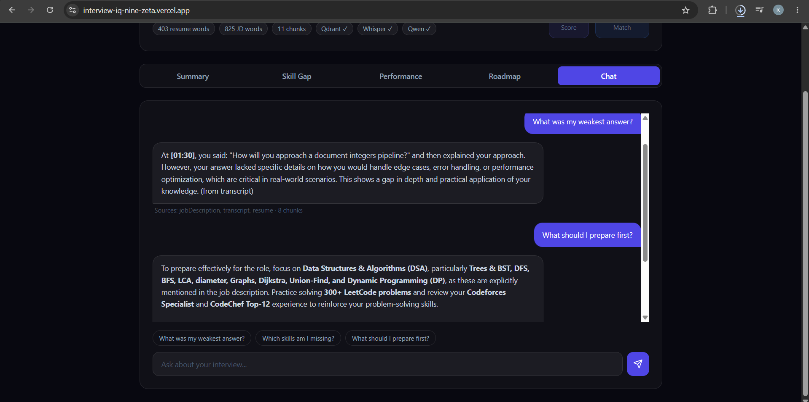

# InterviewIQ : AI-Powered Interview Intelligence Copilot

**Live Demo:** https://interview-iq-nine-zeta.vercel.app/

## Screenshots

### Upload


### Summary


### Skill Gap


### Performance


### Roadmap


### Chat


## What It Does

After every interview I walked out not knowing what actually went wrong. InterviewIQ fixes this - upload your resume, the job description, and your interview recording, and get back a complete breakdown in minutes. It tells you which questions you answered well, which ones showed gaps, exactly which skills the JD requires that your resume doesn't have, and a day by day prep plan for your next round. You can also chat with it after: ask "what was my weakest answer?" and it responds citing the exact timestamp in your recording so you can verify it yourself.

## Why I Built This

I'm a final year ECE student at IIIT Kota, actively interviewing for internships. After every interview — whether it went well or badly I'd have no structured way to understand what happened. I'd try to recall which questions I fumbled but memory right after a stressful interview is unreliable. I'd look at the JD and wonder which of those skills I'd actually demonstrated. I'd have no plan for round two.

I've built full-stack products before — a pair programming platform, an AI code review tool, a job portal. None of them solved this specific problem I kept running into. I wanted something that could take the raw material of an interview and turn it into something actionable. The smallest useful version is exactly what I built: three files in, real feedback out.

## How To Run It

### Prerequisites
- Node.js 20+
- JarvisLabs account (for GPU inference)
- Qdrant Cloud free account

### 1. Clone
```bash
git clone https://github.com/KARTIKAY-SHUKLA1/InterviewIQ.git
cd InterviewIQ
```

### 2. Backend
```bash
cd backend
npm install
```

Create `backend/.env`:
```env
PORT=3000
WHISPER_API_URL=http://localhost:8000
QDRANT_URL=your_qdrant_cloud_url
QDRANT_API_KEY=your_qdrant_api_key
QWEN_API_URL=http://localhost:8002/v1
QWEN_API_KEY=dummy
QWEN_MODEL=Qwen/Qwen3-8B
EMBED_API_URL=http://localhost:8001
EMBED_API_KEY=dummy
```

### 3. Frontend
```bash
cd frontend
npm install
```

Create `frontend/.env`:
```env
VITE_BACKEND_URL=http://localhost:3000
```

### 4. JarvisLabs GPU Setup

Launch an A30 instance, then run:
```bash
pip install fastapi uvicorn openai-whisper transformers torch sentence-transformers accelerate python-multipart
conda install -c conda-forge ffmpeg -y
```

Copy the Python server files from the repo to `/home/user/interviewiq/` and start them:
```bash
nohup uvicorn whisper_server:app --host 0.0.0.0 --port 8000 --app-dir /home/user/interviewiq &
nohup uvicorn embed_server:app --host 0.0.0.0 --port 8001 --app-dir /home/user/interviewiq &
nohup uvicorn qwen_server:app --host 0.0.0.0 --port 8002 --app-dir /home/user/interviewiq &
```

Wait 60 seconds for models to load, then start the backend:
```bash
cd backend && node server.js
```

### 5. Frontend
```bash
cd frontend && npm run dev
```

### Sample Data
The `samples/` folder has a sample resume, Livo AI JD, and a mock interview recording. Upload all three to test without recording your own interview. Processing takes 3-5 minutes.

### Known Limitation
Demo environment limited to ~8MB audio due to JarvisLabs proxy. In production this would use direct S3 upload no size limit.

## Example Chat Questions

These require combining information from all three sources simultaneously:

- *"What was my weakest answer?"* — finds the exact timestamp in transcript, explains why it was weak relative to JD requirements
- *"Which skills from the JD am I missing?"* — compares resume skills against JD requirements precisely
- *"What should I study before my next round?"* — personalizes based on your specific gaps across all three documents

## Processing Time

| Audio Length | Processing Time |
|---|---|
| 5 min | ~2 min |
| 10 min | ~4 min |
| 20 min | ~8 min |

## Architecture Decisions

### Why Whisper instead of cloud STT APIs ?
Interview recordings are personal. Cloud APIs like AssemblyAI send your audio to third-party servers and charge per minute. Whisper runs on our own GPU no cost per call, no data leaving our infrastructure. Base model on A30 handles a 10-minute interview in 3-4 minutes.

### Why BGE-large instead of OpenAI embeddings ?
BGE-large-en-v1.5 tops the MTEB retrieval benchmark for open models. It produces 1024-dimensional vectors and runs on our GPU at zero cost per call. I initially tried 768-dim embeddings and hit a Qdrant dimension mismatch error switching to 1024-dim fixed it and gave better retrieval quality.

### Why Qdrant instead of Pinecone ?
Free cloud tier, no credit card required. More importantly, Qdrant supports payload filtering I use this to filter chunks by sessionId so each interview analysis is completely isolated. Every upload gets its own session and its own vector space.

### Why chunk text instead of embedding full documents ?
If I embed an entire resume as one vector, the chat can't answer "what projects did I mention?" precisely it would retrieve the whole resume for every question. Chunking into 200-word pieces with 40-word overlap lets the RAG retrieve exactly the right section. The overlap prevents context loss at chunk boundaries.

### Why async processing with polling ?
Whisper takes 3-5 minutes on a 10-minute audio file. Synchronous HTTP requests timeout through Cloudflare's proxy at 120 seconds. The endpoint returns a jobId immediately, processes everything in the background, and the frontend polls every 5 seconds. Standard pattern for long-running AI tasks works for any audio length.

### Why timestamp citations in chat ?
Whisper returns word level timestamps with every transcription. I store the start timestamp with each transcript chunk in Qdrant as metadata. When the chat retrieves relevant chunks, Qwen sees "Source: transcript at 03:28" and cites it in the answer. The user can scrub to that exact moment and verify what the AI is referencing.

### Why not LangChain ?
I built the RAG pipeline from scratch custom chunker, direct Qdrant client, manual embedding calls. Two reasons: I wanted to understand every part of the pipeline so I can explain it clearly, and LangChain abstracts away the exact behavior I needed to control (chunk overlap, payload metadata, session filtering).

### Why deterministic skill extraction instead of asking Qwen ?
Early versions asked Qwen to extract skills from the resume and JD. It hallucinated showing Node.js as "missing" when it was clearly in the resume. I replaced this with keyword matching against a list of 60+ tech skills. Qwen still generates the qualitative analysis (summary, performance, roadmap) but skill gap is computed in code deterministic, no hallucination possible.

### Why Qwen3-8B instead of other LLMs ?
Several open models were viable like - Llama 3.1-8B, Mistral-7B, Gemma 2-9B. I chose Qwen3-8B for two specific reasons. First, Qwen3 follows structured JSON output instructions more reliably than alternatives this matters because the analysis pipeline depends on strict JSON format for summary, performance, and roadmap. In testing, Llama and Mistral broke the JSON format more often requiring fallback handling. Second, interview data is personal and sensitive sending audio recordings and resumes to GPT-4 or Claude raises real privacy concerns. Running Qwen3-8B on our own GPU keeps all data within our infrastructure. For production I'd evaluate Qwen3-14B on an A100 for sharper analysis quality.

## What I Used AI For

AI was my pair programmer throughout helped with Express boilerplate, Tailwind classes, and debugging error messages I hadn't seen before.

The decisions that mattered I made myself or actively disagreed with what was suggested:

- **RAG pipeline** :  AI suggested LangChain. I rejected it and built from scratch because I wanted to understand every component and explain it clearly without guessing.
- **Embeddings** : AI suggested 768-dim embeddings. I changed to 1024-dim after hitting a Qdrant dimension mismatch error turned out I was using the wrong BGE model variant.
- **Roadmap generation** : AI suggested a single LLM call for the full roadmap. I split into 3 separate calls after the single call produced identical tasks in all three columns.
- **Async processing** : AI suggested keeping the analyze endpoint synchronous. I made it async with polling after hitting Cloudflare's 120-second timeout repeatedly.

The core architecture async job pattern, sessionId isolation, deterministic skill extraction replacing AI-based extraction after catching hallucinations, timestamp citations. I designed these after hitting real problems, not from suggestions.

## What I Would Change With 4 More Weeks

**Speaker diarization** : right now the transcript is one blob of text. A real interview has two speakers interviewer and candidate. Separating them would let me analyze only the candidate's answers, not the questions, making performance scoring significantly more accurate.

**Whisper Large V3 on A100** : base model on A30 works but misses technical terms occasionally. Large V3 would give near perfect transcription for terms like "FastAPI", "Qdrant", "BGE" that base sometimes gets wrong.

**Round tracking** : upload interviews from multiple rounds for the same role and see skill improvement over time. The sessionId architecture already supports this conceptually it just needs a user account system to associate sessions.

**Persistent storage** : analysis results live in memory and disappear on server restart. MongoDB is already in the stack from my other projects wiring it up for session persistence would make the product actually usable day to day.

**Direct S3 upload** : bypass the JarvisLabs proxy for file uploads. Currently limited to ~8MB due to proxy constraints. S3 presigned URLs would support hours of audio with no size limit.